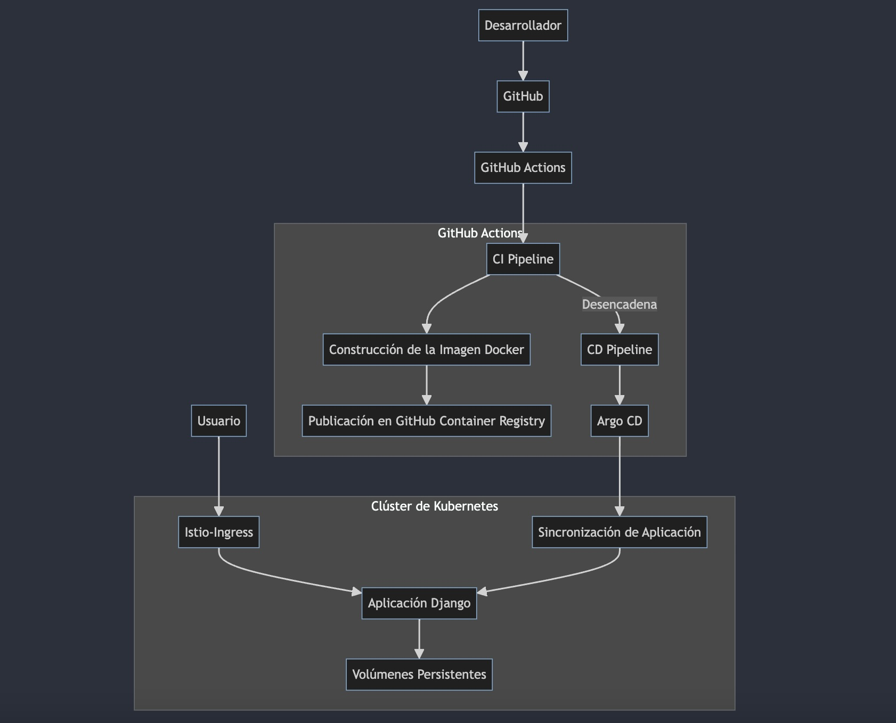

# Diagrama de la Aplicación

## Descripción del Diagrama de la Aplicación

- **Desarrollador**: El desarrollador realiza cambios en el código fuente y lo sube a GitHub.
- **GitHub**: Repositorio donde se aloja el código fuente del proyecto.
- **GitHub Actions**: Plataforma de integración continua y entrega continua (CI/CD) que ejecuta pipelines automatizadas.
  - **CI Pipeline**: Pipeline de integración continua que construye la imagen Docker y la publica en el GitHub Container Registry.
  - **Construcción de la Imagen Docker**: Proceso de creación de una imagen Docker a partir del código fuente.
  - **Publicación en GitHub Container Registry**: Almacena la imagen Docker construida en el registro de contenedores de GitHub.
  - **CD Pipeline**: Pipeline de entrega continua que despliega la aplicación en el clúster de Kubernetes usando Argo CD.
  - **Argo CD**: Herramienta de entrega continua para Kubernetes que gestiona el despliegue de las aplicaciones.
- **Clúster de Kubernetes**: Entorno de orquestación de contenedores donde se despliega la aplicación.
  - **Istio-Ingress**: Controlador de entrada que gestiona el tráfico externo al clúster de Kubernetes.
  - **Aplicación Django**: Aplicación web desplegada en el clúster de Kubernetes.
  - **Volúmenes Persistentes**: Almacenamiento persistente utilizado por la aplicación.
  - **Sincronización de Aplicación**: Proceso de Argo CD que asegura que el estado deseado de la aplicación se mantenga en el clúster.
- **Usuario**: Interactúa con la aplicación a través del Istio-Ingress.