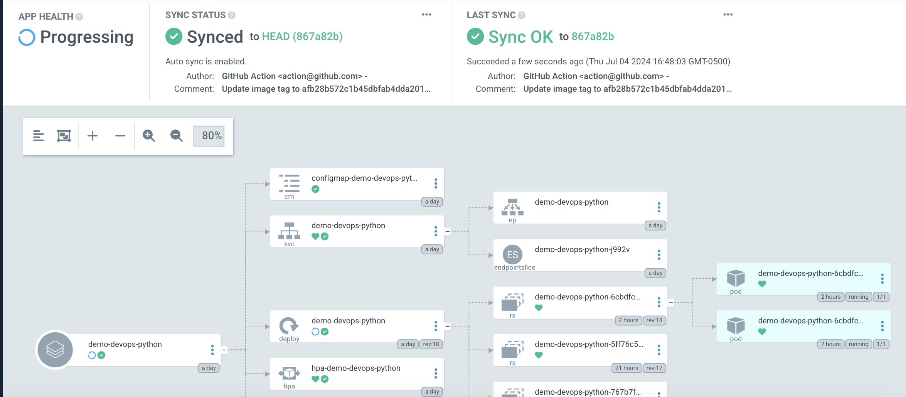

# Documentación del Proyecto

Este documento describe la implementación de una aplicación web utilizando Docker, Kubernetes y GitHub Actions para CI/CD. A continuación, se detallan los componentes del proyecto, las decisiones técnicas tomadas y los pasos seguidos para cumplir con los requisitos de la prueba técnica.

## Contenido
- [Introducción](#introducción)
- [CI Pipeline](ci_pipeline.md)
- [CD Pipeline](cd_pipeline.md)
- [Dockerfile](docker.md)
- [Recursos de Kubernetes](kubernetes_resources.md)
- [Gestión de Secretos](secrets_management.md)
- [Diagramas](diagrams.md)


## Acceso a Argo CD
Puedes acceder a la interfaz de Argo CD en el siguiente enlace: [Argo CD](https://34.30.114.5/argocd).



## Ejemplos de cURL

### Crear un usuario
```bash
curl -X POST http://35.224.250.136/api/users/ -H "Content-Type: application/json" -d '{"dni": "12345678", "name": "John Doe"}'
```
### Obtener todos los usuarios
```bash
curl -X GET http://35.224.250.136/api/users/ | jq
```